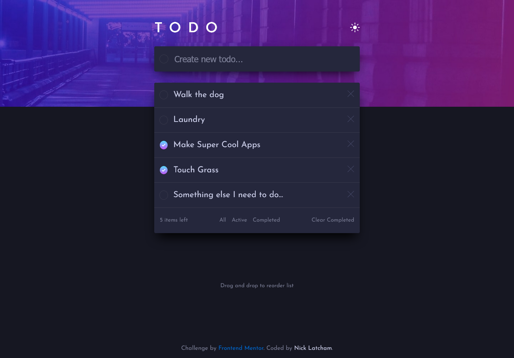

# Frontend Mentor - Todo app solution

This is a solution to
the [Todo app challenge on Frontend Mentor](https://www.frontendmentor.io/challenges/todo-app-Su1_KokOW). Frontend
Mentor challenges help you improve your coding skills by building realistic projects.

## Table of contents

- [Overview](#overview)
    - [The challenge](#the-challenge)
    - [Screenshot](#screenshot)
    - [Links](#links)
- [My process](#my-process)
    - [Built with](#built-with)
- [Author](#author)

**Note: Delete this note and update the table of contents based on what sections you keep.**

## Overview

### The challenge

Users should be able to:

- [ ] View the optimal layout for the app depending on their device's screen size
- [x] See hover states for all interactive elements on the page
- [x] Add new todos to the list
- [x] Mark todos as complete
- [x] Delete todos from the list
- [x] Filter by all/active/complete todos
- [x] Clear all completed todos
- [ ] Toggle light and dark mode
- [x] **Bonus**: Drag and drop to reorder items on the list

### Screenshot

### Links

- Solution URL: [Add solution URL here](https://github.com/nicklatch/fe-mentor-todo-app)
- Live Site URL: Coming soon!

## My process

### Built with

- Go (net/http)
- HTMX
- Sortable.js
- CSS

## Author

- GitHub - [@nicklatch](https://github.com/nicklatch)
- Website - [Nick Latcham](https://nicklatcham.dev)
- Frontend Mentor - [@nicklatch](https://www.frontendmentor.io/profile/nicklatch)
- Twitter - [@Nick_Latcham](https://twitter.com/Nick_Latcham)
